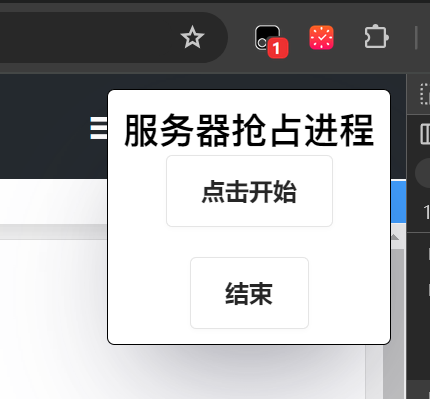
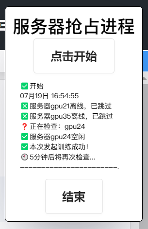
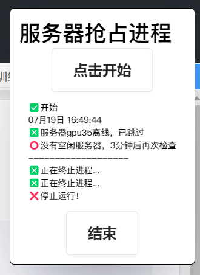

# 功能
1. 循环查询并抢占空闲服务节点
2. 抢占失败等待3分钟重新查询
3. 抢占成功后，等待5分钟再继续抢占

# 使用方法
## step1 安装脚本
1. 在Chrome中安装[篡改猴插件](https://chromewebstore.google.com/detail/%E7%AF%A1%E6%94%B9%E7%8C%B4/dhdgffkkebhmkfjojejmpbldmpobfkfo)并固定到任务栏
2. 点击右上角插件栏中的**篡改猴插件图标**，点击**添加新脚本**
3. 将**seize_v1.js**拖动到窗口即完成安装

## step2 使用
1. 登录首页
2. 点击**训练任务管理tab**
3. 自动跳出“服务器抢占进程”,请注意篡改猴出现1角标代表脚本成功开启
    
4. 点击开始即可
5. 抢占成功后，将自动化创建新任务和开始训练，并将会发送邮件通知
    
6. 没有空闲服务器时，3分钟后重新查询
    

## 注意
1. 关闭浏览器或网页，脚本终止
2. 全程请保持在`/#/trainingTaskManagement`页面

## DIY
1. 更新服务器列表可修改`SERVER_IDS`变量
2. 更新服务器详情可修改`serves_raw`

# todo
- [ ] 按钮颜色/提示优化
- [ ] 没有对账号自动注销做测试
